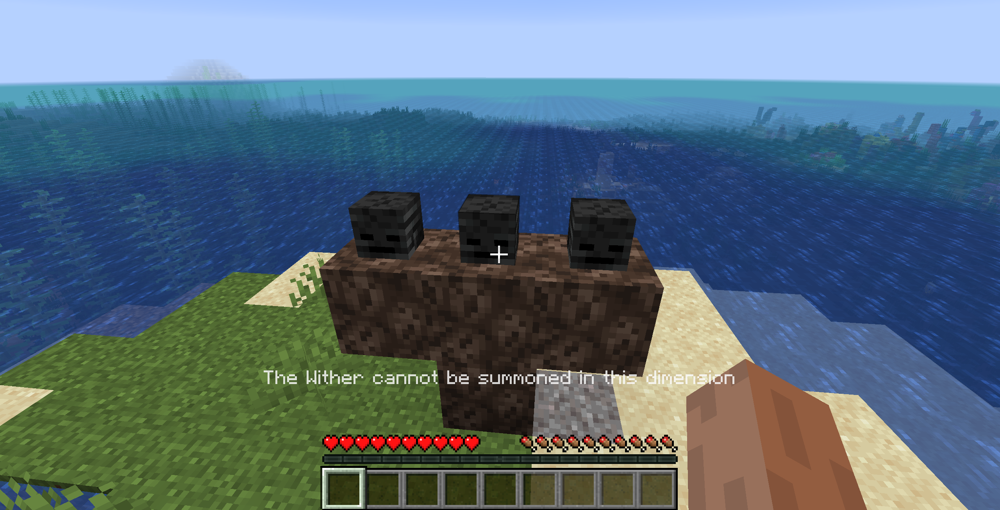

# Wither dimension filter

Prevents the wither from spawning outside the nether.

This mod works differently than the alternative: 
Instead of preventing the wither itself from spawning (but still deleting your structure & destroying your wither skulls),
it force-fails the structure check. Meaning your structure is still there! No lost items.
